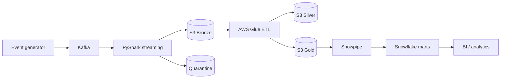

# Real-Time E-Commerce Analytics Pipeline

[](https://www.python.org/)
[](LICENSE)

An end-to-end data engineering portfolio project that ingests clickstream and order events through Apache Kafka, transforms them with PySpark/AWS Glue, stores governed Bronze–Silver–Gold datasets in Amazon S3, and publishes analytics-ready marts in Snowflake.

## Business outcomes

- Near-real-time visibility into gross/net revenue and order volume
- Product conversion and category performance analysis
- Customer engagement, lifetime value, and purchase behavior
- Inventory movement and low-stock monitoring
- Data-quality quarantine, deterministic deduplication, and replayable ingestion

## Architecture



| Layer | Purpose | Format / partitioning |
|---|---|---|
| Bronze | Immutable raw events with ingestion metadata | JSON/Parquet, event date/hour |
| Silver | Typed, validated, deduplicated domain tables | Parquet, event date |
| Gold | Business aggregates and conformed dimensions | Parquet, metric date |
| Snowflake | Secure analytics models and views | Incremental SQL models |

## Repository layout

```text
producer/            Synthetic clickstream and order producer
streaming/           Kafka-to-Bronze Structured Streaming job
glue/                Bronze-to-Silver/Gold AWS Glue job
snowflake/           DDL, Snowpipe, and analytics models
infrastructure/      Terraform for S3, IAM, Glue, and notifications
tests/               Unit tests for validation and transformations
docs/                Data contract and operating guide
```

## Quick start (local)

Requirements: Docker with Compose, 6 GB free memory, and `make`.

```bash
cp .env.example .env
make up
make produce
make logs
```

Kafka UI: <http://localhost:8080>. Generated events are available on `clickstream-events` and `order-events`. To stop the stack:

```bash
make down
```

## Run and test without Docker

```bash
python -m venv .venv
source .venv/bin/activate
pip install -r requirements-dev.txt
pytest -q
ruff check .
```

## Cloud deployment

1. Configure AWS credentials and initialize Terraform.
2. Create infrastructure with `terraform apply`.
3. Upload the packaged Glue job to the scripts bucket and start the job.
4. Run the Snowflake scripts in numeric order, replacing the documented placeholders.
5. Configure Snowpipe auto-ingest using the SQS ARN returned by Snowflake.

See [docs/DEPLOYMENT.md](docs/DEPLOYMENT.md) for commands, security controls, observability, and teardown.

## Data quality and reliability

- JSON Schema-compatible event contracts with required-field validation
- Event ID deduplication with a 10-minute streaming watermark
- Invalid records retained in a quarantine prefix with failure reasons
- Checkpointed Kafka offsets for restart-safe processing
- Server-side encryption, S3 public-access blocking, versioning, and lifecycle policies
- CloudWatch metrics/alarms plus Snowflake load-history monitoring

## Example analytics

```sql
SELECT metric_date, SUM(net_revenue) AS net_revenue
FROM analytics.fct_daily_product_performance
WHERE metric_date >= DATEADD(day, -30, CURRENT_DATE())
GROUP BY metric_date
ORDER BY metric_date;
```

## Cost notes

The local demo is free aside from local compute. In AWS, lifecycle rules move old Bronze data to cheaper storage; Glue workers and Snowflake warehouses should use auto-stop/auto-suspend. Destroy cloud resources after evaluation.

## License

MIT — see [LICENSE](LICENSE).
